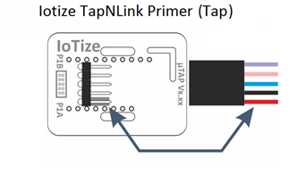
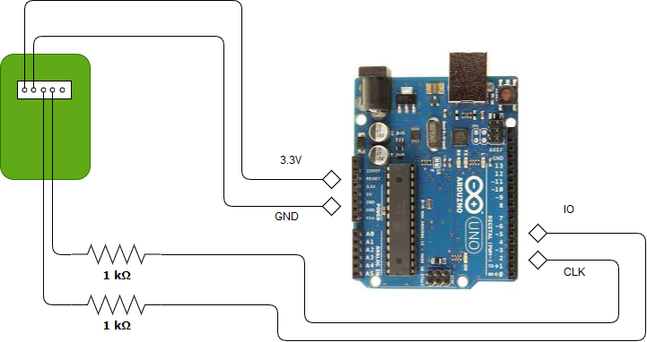
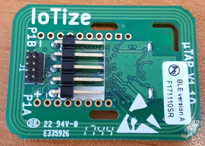
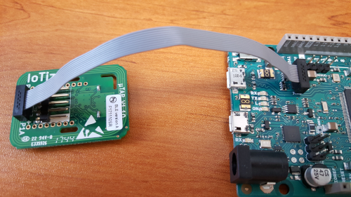
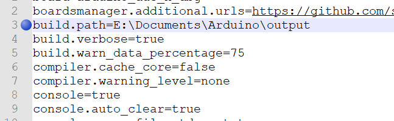

# How to iotize your Arduino board

This application note shows how to add wireless connectivity to an Arduino application using TapNLink.

Only a few minutes are required to iotize a Cortex-M based embedded application. Integration is easy with most Arduino boards by using the library concept. 

## Supported Arduino hardware

Arduino is a family based on different architectures. 
TapNLink supports any microcontroller and any architecture, but  the way to add a TapNLink module could vary slightly.
The main criteria are the voltage of the I/O pins, and the core. 
We have tested them on 3 popular boards: 

| Model | Processor | IOs Voltage |     
|:-----:|:---------:|:------------|
| Uno	| AVR (ATmega328)	| 5V |
| Due	| Cortex-M (ATSAM3X8E)	| 3V |
| Mega2560	| AVR (ATmega2560)	| 5V |

### Core dependency

- Cortex-M based boards use either S3P or SWD debug protocols. SWD is easier for a Proof of Concept (e.g. for  Cortex-M based processors).
   - SWD is managed by the hardware of the core and is very simple to use. It offers: 
      - the ability to start immediately, without modifying the firmware,
     - various advanced features such as  update of the target (Arduino) firmware from a mobile.
   - S3P provides a better security level, but security is not always the most important criteria for a Proof of Concept.  

- For other processors  (and some Cortex-M based), the Tap library must be added. This document describes how to use this library. 
 
### I/O voltage

Processors with 5V digital pins need the voltage levels adapting. Several solutions are possible, the simplest is to insert a resistor for each digital signal. 
 
Whatever the protocol (SWD/S3P), 4 wires are needed to make the Arduino board communicate with TapNLink, two for the power supply (GND et Vcc3.3) provided by the Arduino to TapNLink, and two for the digital signals: clock and data.

|  Type   |  Name    | Description |     
|:-------:|:--------:|:------------|
| Power	  |  Gnd     |   Ground          |
| Power	  |  Vcc3_3  |   MUST BE 3V or 3.3V |
| Digital |  CLK     | Must be an interrupt (or could be SWD-CLK for Cortex-M devices) |
| Digital |  IO      |   Clk and IO must be adapted (resistor) for 5V processors  |
	

Optionally, a reset signal can be added if you may want to reset the Arduino board from the TapNLink module. 

WARNING: With a 5V board, connect the 3.3V pin. **DO NOT CONNECT 5V**, it will destroy your Tap!

## Let's connect the boards

### TapNLink signals

For both SWD and S3P, the 4 signals are available one of two connectors:
 - a small 10-contact, 1.27mm (ARM compatible) dual row connector,
 - a bigger 5-contact, 2.54mm single row connector.

For Primers, connect the provided 5-wire cable as follows:     

The pinout is as follows: 

|  Type   |  Signal | 5-pin header   | wire   | 10-pin header (ARM) |      
|:-------:|:-------:|:--------------:|:------:|:-------------------:|
| Power	  |  Vcc3.3 | 1              | Red    | 1                   |
| Power	  |  Gnd    | 2              | Black  | 3,5,9               |
| Digital |  CLK    | 4              | Pink   | 4                   |
| Digital |  IO     | 3              | Blue   | 2                   |
| Digital |  RST    | 5              | Purple | 10                  |

### Connecting a 5V Arduino Uno or MEGA2560

**Do not** connect the Tap to the 5V power!

Insert a 1 K-ohm (2200 ohm) resistor between the TapNLink and Arduino for  the Clock and IO signals. This resistor  limits the current without degrading the signals too much. Applying  a 5V 'push-pull' output directly to  TapNLink inputs could damage the  TapNLink processor.     

The schematic below shows the connection between Arduino-Uno and TapNLink:

 

#### IO signal
IO signal can be connected to any digital I/O. 

#### Clock signal
The clock must be connected to an interrupt input of the processor. This table summarizes which pins are usable for interrupts:

| Board | Digital Pins Usable For Interrupts | Status |
|:-------:|:-------------------:|:---------:|
| Uno, Nano, Mini, other 328-based | 2,3 | Tested |
| Uno WiFi Rev.2 | all digital pins | Not tested |
| Mega, Mega2560, MegaADK | 2, 3, 18, 19, 20, 21 | Tested |
| Micro, Leonardo, other 32u4-based | 0, 1, 2, 3, 7 | Not tested |
| Zero | all digital pins, except 4 | not tested |
| MKR Family boards | 0, 1, 4, 5, 6, 7, 8, 9, A1, A2 | Not tested |
| Due | all digital pins | Tested |
| 101 | all digital pins | Not tested |

So for example, with Arduino Uno, only pins 2 and 3 can be used for CLK. 

In our example, CLK is connected to pin 3 for the Arduino UNO board and IO (data) is connected to pin 5. This can be modified directly when calling the Init() function:
        myTap.Init(3,5); // clk = 3 and data = 5

### Connecting TapNLink to the the Arduino DUE (or any Cortex-M board)

#### Arduino DUE with SWD 
Simply connect TapNLink to the debug port (SWD / JTAG). The library is not used.

If you have a TapNLink Primer, you must add a 2x5 male header (pitch 1.27mm)  to your TapNLink:

You can then link the two boards with a simple ribbon (10 wires, 0.635mm pitch):

#### Aduino DUE with S3P
Connect Vcc (3.3V) and Gnd. 

Use any pair of digital signals available on the connectors. In the example, we selected pin 16 for CLK and 17 for data (IO). 
Note that the signals of the 5-pin connector (single row) are also on the 10-pin ARM connector (double row). You can use either (the 5-pin is often easier to connect for Arduino boards).  

### Other Cortex-M boards with SWD
The debug port is not always available. Boards provided by the silicon vendors (Nucleo from ST, ...)  often have an embedded debugger connected to the debug port. You may encounter several situations:
  - the debug port is not available (no connector). SWD must be discarded and S3P used.
  - the debug port exists, but the debugger cannot be disabled. Again, you have to use S3P.
  - a connector exists but the debugger stays in Hi-Z as long as its USB port is left unconnected. 
  - jumpers allow to disconnect the embedded debugger.

Depending on your situation, you will have to analyse the schematic and check whether an embedded debugger is a problem. 
On the DUE board, the debug board is just connected to the "jtag connector". It can be used without restriction. 

### Other processors
The library (Tap.cpp file) can easily be adapted to any processor. It must be edited to clear the interrupt flag (see Tap::ConfigureIOs() in tap.cpp).

Note that clearing the IRQ flags is mandatory: on most processors, toggling the clock signal that has been used to trigger the interrupt keeps the IRQ flag active during the interrupt processing. At the return from the handler, the flag would be still active and would loop launching the interrupt handler. 

## Relocating the output directory 

IoTize Studio configuration needs the elf file to read the list of the global symbols (output from linker). By default, the Arduino IDE generates this file into a temporary directory but a more accessible location can be specified. You have to follow this exact sequence:  

1. Open the  ‘Preferences.txt’ file (find it by clicking on: 
        File | Preferences | More preferences can be edited...) 

2. Close the Arduino IDE because it would  overwrite our new preferences.txt file and loose our changes. 
3. Add the line:   
        ‘build.path=…’ 
and specify after '=' an 'output' subfolder of your sketchbook directory. For example, below the sketchbook directory is E:\Documents\Arduino:  

 

4. Save this file. 
5. Reopen Arduino IDE and the next generated elf files will be saved into this 'output' subfolder. 

## Start with IoTize Studio
IoTize Studio is a free software available on the iotize.com web site:

        http://docs.iotize.com/Downloads/

Refer to IoTize Studio documentation available on the same website: 

        http://docs.iotize.com/UserManuals/IotizeStudio/

### Create a new project (.iotz)
The Tap library assumes the default path of your IoTize Studio project is:

        {sketchbook_folder}/TapNLink/

Any other location will work but, when selecting S3P, the tap.cpp finds the S3P_conf.h file using a relative reference. If you place your iotz files anywhere else, you will have to modify this path.  

The tree should look like: 

        {sketchbook_folder}/
                project1/
                        project1.ino
                project2/
                        project2.ino
                ...
                projectN/
                        projectN.ino
                libraries/
                        tap/
                                examples/
                                        tapdemo.ino
                                src/
                                        tap.cpp
                                        tap.h
                                library.properties
                                keywords.txt
                                readme.md
                        other_libs/
                                ...
                output/
                        core/
                        libraries/
                        preproc/
                        sketch/
                        project1.ino.elf
                        project1.ino.map
                        project2.ino.elf
                        project2.ino.map
                        ...
                TapNLink/
                        project1.iotz
                        project2.iotz
                        S3P_conf.h
                                

#### Main settings

In IoTize Studio, create a new project in the {sketchbook_folder}\TapNLink directory and specify in the wizzard dialog bog the elf file of your Arduino project (previously compiled). Then change in the IOTZ Explorer pane:
        - 'IoTized Application | Target | Target protocol' => S3P
        - 'IoTized Application | Target | S3P configuration ' => S3P mode = Indexed and Delay = 1ms

You will have to configure IoTized Application | Studio parameters. For this part, please refer to the IoTize Documentation Center ( [Getting Started with TapNLink](http://docs.iotize.com/GettingStarted/TapNLink/) and [IoTize Studio manual](http://docs.iotize.com/UserManuals/IotizeStudio/)).

        

#### Adding variables
The list of the available symbols (read from your elf file) is available in the 'Resource View' pane. You can drag and drop them to the default bundle and they will appear on the generated web page.  

## Modify your existing Arduino file (.ino)

Once the Tap library is installed, you must include it in your project (e.g. add #include "tap.h" at the top of your .ino file). This is done automatically by executing from Arduino IDE menu:
        Sketch | Include library | Tap

You also need to initialise the Tap handler. This is done by adding the line:
        myTap.Init(pin_clk, pin_io); 
where pin_clk is the pin reference for the interrupt pin you selected and pin_io is the pin reference for the data. That's it!

### Compile your new Arduino project

If the library is correctly included in your project, the Arduino file should compile without problem after adding call to myTap.Init().

If the library does not compile because the S3P_conf.h generated by IoTize Studio is not found. The causes could be:
 - the path is not correct because you didn't structure the folders as expected. Modify in tap.cpp the line: 
            #include "..\..\..\TapNLink\S3P_conf.h"
to make S3P_conf.h accessible. 
 - S3P_conf.h has not been generated because S3P protocol is not selected => select the right protocol in "IoTize Explorer" | "Target" | "Link Target <=> Tap". 

### Synchronizing "Arduino project <=> configuration"

When saving the configuration file, IoTize Studio generates a S3P_conf.h file that is required for compiling Tap.cpp (from the library). Indeed, this file is needed to generate the final ELF file. But to generate this file from the IOTZ configuration... you need the ELF file!

To break the loop for ever:
 - you can start with your initial ELF file (generated before iotizing your project). Once an S3P_conf.h file is generated, it will be used when compiling the Arduino file. 
 - when you think your configuration is done, save your project, then compile the project from the Arduino file, then repeat this sequence once more.

 Note that there is a difference between S3P and SWD addressing:
  - SWD manipulates absolute addresses. Every time you change (and reprogram) your firmware, you risk having a different mapping of the selected variables. This means that if an address has been modified,you must regenerate the configuration in IoTize Studio and then reconfigure your Tap.
  - S3P manipulates indexes that are quite stable. This means that as long as you don't add a new variable accessible by TapNLink, you can keep the same Tap configuration (even if you modify your firmware).  

## Configure your Tap

Again, refer to the IoTize documentation center to configure your tap. Once configured, you can either test from IoTize Studio, or "tap and view" your new app from your mobile.

## Frequent issues

### The output file (ELF) is not generated in the right directory

You need to follow the sequence described above. If you don't close Arduino IDE  ** **BEFORE** ** editing the preferences.txt file, your changes will be lost. 

### Some errors occur when reading some variables 

To synchronize the ELF file with the S3P_conf.h file, you need to repeat **TWICE** the sequence : 

 - compile,
 - save the configuration file from IoTize Studio

then you can upload the firmware onto the Arduino board and test the result. 
Note that you need the ELF file to make IoTize Studio to generate the S3P_conf.h... needed to generate the ELF file.  If you have entered this loop, you can break the loop by commenting out the call to "myTap.Init" in order to generate the ELF file then to do the synchronization process.  

### S3P communication does not work at all...

The possible known issues are: 
 - with the hardware: check the wires/connections. 
 - with your TapNLink: check that the version of your TapNLink is 1.45 or greater... 
 - with your change: check that you call 'myTap.Init(clk, data) with the right pin numbers,
 - with the pin selection: check that the pin number used for clk is an interrupt pin,
 - with the interrupt handling: check that this interrupt is properly managed by Arduino and by tap.cpp (see in the library). If is is not supported by the current version of tap.cpp, you could easily add the C line required to clear the interrupt flag in Tap::ConfigureIOs().
 

  

