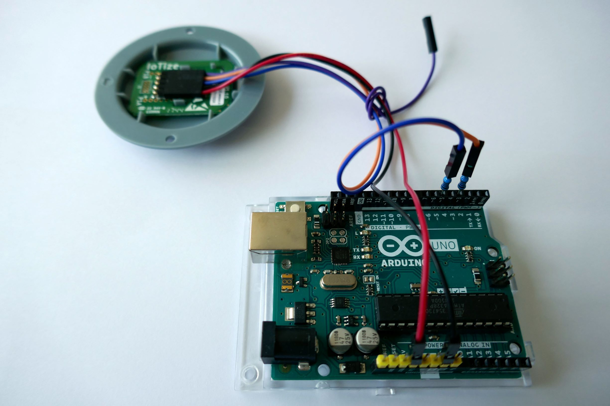

# How to iotize your Arduino board

TapNLink supports all microcontrollers and architectures.

This page shows how to add wireless connectivity to an Arduino application using TapNLink. 

Only a few minutes are required to iotize a Cortex-M based embedded application. Integration is easy with other Arduino boards by using the TAP library. 

## Supported Arduino hardware

Arduino is a family based on different architectures, so the way to add a TapNLink could vary slightly. 
The main criteria are the core and I/O pins voltage. 
We tested them on 3 popular boards: 

| Model | Processor | IOs Voltage |     
|:-----:|:---------:|:------------|
| Uno	   | AVR (ATmega328)	  | 5V |
| Due      | Cortex-M (ATSAM3X8E) | 3V |
| Mega2560 | AVR (ATmega2560)     | 5V |

### Core dependency

- Cortex-M based boards use either S3P or SWD debug protocols.
   - SWD is easiest for a Proof of Concept (e.g. for  Cortex-M based processors). It is managed by the hardware of the core and is very simple to use. It offers: 
      - the ability to start immediately, without modifying firmware,
      -  advanced features such as  target (Arduino) firmware update from a mobile.
   - S3P provides a better security level, but security is not always important for a Proof of Concept.  

- Other processors  (and some Cortex-M based) require the Tap library to be added.  
 
### I/O voltage

Processors with 5V digital pins need the voltage levels adapting. 
WARNING: With a 5V board, connect the 3.3V pin. **DO NOT CONNECT 5V**, it will destroy your Tap!

Several solutions are possible, the simplest is to insert a resistor for each digital signal. 
 Whatever the protocol (SWD/S3P), 4 wires are needed to make the Arduino board communicate with TapNLink, two for the power supply (GND et Vcc3.3) provided by the Arduino to TapNLink, and two for the digital signals: clock and data.

|  Type   |  Name    | Description |     
|:-------:|:--------:|:------------|
| Power	  |  Gnd     |   Ground          |
| Power	  |  Vcc3_3  |   MUST BE 3V or 3.3V **DO NOT CONNECT 5V**, it will destroy your Tap!|
| Digital |  CLK     | Must be an interrupt (or could be SWD-CLK for Cortex-M devices) |
| Digital |  IO      |   CLK and IO must be adapted (resistor) for 5V processors  |
	

Optionally, a reset signal can be added if you may want to reset the Arduino board from the TapNLink module. 

## TapNLink signals

### SWD and S3P
The 4 signals are available one of two connectors:
 - a small 10-contact, 1.27mm (ARM compatible) dual row connector,
 - a bigger 5-contact, 2.54mm single row connector.

### Primers
Connect the provided 5-wire cable as follows:     

The pinout is as follows: 

|  Type   |  Signal | 5-pin header   | wire   | 10-pin header (ARM) |      
|:-------:|:-------:|:--------------:|:------:|:-------------------:|
| Power	  |  Vcc3.3 | 1              | Red    | 1                   |
| Power	  |  Gnd    | 2              | Black  | 3, 5, 9               |
| Digital |  CLK    | 4              | Pink   | 4                   |
| Digital |  IO     | 3              | Blue   | 2                   |
| Digital |  RST    | 5              | Purple | 10                  |

## Arduino Clock signals
The clock must be connected to an interrupt input of the processor. This table summarizes which pins are usable for interrupts:

| Board | Digital Pins Usable For Interrupts | Status |
|:-------:|:-------------------:|:---------:|
| Uno, Nano, Mini, other 328-based | 2,3 | Tested |
| Uno WiFi Rev.2 | all digital pins | Not tested |
| Mega, Mega2560, MegaADK | 2, 3, 18, 19, 20, 21 | Tested |
| Micro, Leonardo, other 32u4-based | 0, 1, 2, 3, 7 | Not tested |
| Zero | all digital pins, except 4 | not tested |
| MKR Family boards | 0, 1, 4, 5, 6, 7, 8, 9, A1, A2 | Not tested |
| Due | all digital pins | Tested |
| 101 | all digital pins | Not tested |

So for example, with Arduino Uno, only pins 2 and 3 can be used for CLK. 

## Connect the boards

### Connect to a 5V Arduino Uno or MEGA2560

**Do not** connect the Tap to the 5V power!

Insert a 1 Kohm (2200 ohm) resistor between the TapNLink and Arduino for  the Clock and IO signals. This resistor  limits the current without degrading the signals too much. Applying  a 5V 'push-pull' output directly to  TapNLink inputs could damage the  TapNLink processor.     

The schematic below shows the connection between Arduino-Uno and TapNLink:

 

#### IO signal
IO signal can be connected to any digital I/O. 

#### Clock signal

With Arduino Uno, only pins 2 and 3 can be used for CLK (see [summary](##arduino%20clock%20signals) for list of useable pins). 

In our example, CLK is connected to pin 3 for the Arduino UNO board and IO (data) is connected to pin 5. This can be modified directly when declaring your tap (see the example): 
`Tap  myTap.Init(3,5); // clk = 3 and data = 5`

### Connect to an Arduino DUE and other Cortex-M boards

#### Arduino DUE with SWD 
Simply connect TapNLink to the debug port (SWD / JTAG). The library is not used.

Take care to connect **Vcc** only to **3.3V**.

If you have a TapNLink Primer, you can use either:
 - 2x5 male header (pitch 1.27mm), ARM compatible (J1),
 - single row 5 pins header (pitch 2.54mm).

You can then link the two boards with a simple ribbon (10 wires, 0.635mm pitch):

or with the 5 flying wires:

#### Aduino DUE with S3P
Connect Vcc (3.3V) and Gnd. 

Use any pair of digital signals available on the connectors. In the example, we selected pin 16 for CLK and pin 17 for data (IO). 

Note that the signals of the 5-pin connector (single row) are also on the 10-pin ARM connector (double row). You can use either, but the 5-pin often connects easier with Arduino boards.  

#### Other Cortex-M boards with unavailable debug port

The debug port is not always available, but boards provided by silicon vendors (e.g. Nucleo from ST)  often have an embedded debugger connected to the debug port. You may encounter several situations :
  - the debug port is not available (no connector). SWD must be discarded and S3P used.
  - the debug port exists, but the debugger cannot be disabled. Again, you have to use S3P.
  - a connector exists but the debugger stays in Hi-Z as long as its USB port is left unconnected. Again, use S3P.
  - jumpers allow to disconnect the embedded debugger.

You will have to analyse the schematic and check whether an embedded debugger is a problem. 
On the DUE board, the debug board is connected to the JTAG connector and can be used without restriction. See [summary](##arduino%20clock%20signals) for list of useable pins.

### Connect to other processors
The library (*Tap.cpp* file) can easily be adapted to any processor, it must simply be edited to clear the interrupt flag (see `Tap::ConfigureIOs()` in *tap.cpp*).

On most processors, the clock signal that triggered the interrupt keeps the IRQ flag active during interrupt processing. At the return from the handler, the flag is still active and loops launching the interrupt handler, so it is mandatory to clear the IRQ flags.

See [summary](##arduino%20clock%20signals) for list of useable pins.

## Relocating the output directory 

IoTize Studio configuration needs the *elf* file to read the list of the global symbols (output from linker). By default, the Arduino IDE generates this file into a temporary directory, but a more accessible location can be specified if you follow this exact sequence:  

1. Open the  *Preferences.txt* file (find it by clicking on: 
        File | Preferences | More preferences can be edited...).

2. Close the Arduino IDE because it would  overwrite our new *preferences.txt* file and loose our changes. 
3. Add the line:           `build.path=…` 
 specify the `output subfolder` of your sketchbook directory. For example, below the sketchbook directory is E:\Documents\Arduino:  

 

4. Save this file. 
5. Reopen Arduino IDE and the next *elf* files that are generated are saved in this `output subfolder`. 

## Get started with IoTize Studio and S3P
IoTize Studio is free software available on the iotize.com web site: [http://docs.iotize.com/Downloads](http://docs.iotize.com/Downloads/).

IoTize Studio documentation is available on the same website: [http://docs.iotize.com/UserManuals/IotizeStudio](http://docs.iotize.com/UserManuals/IotizeStudio/).

### Create a new project (.iotz)
The Tap library assumes the default path of your IoTize Studio project is: `{sketchbook_folder}/TapNLink/`

If you place your *iotz* files anywhere else you will have to modify this path. In S3P the *tap.cpp* uses a relative reference to find the *S3P_conf.h* file.

The tree should look like: 

        {sketchbook_folder}/
                project1/
                        project1.ino
                project2/
                        project2.ino
                ...
                projectN/
                        projectN.ino
                libraries/
                        ArdTap/
                                examples/
                                        tapdemo.ino
                                src/
                                        tap.cpp
                                        tap.h
                                library.properties
                                keywords.txt
                                readme.md
                        other_libs/
                                ...
                output/
                        core/
                        libraries/
                        preproc/
                        sketch/
                        project1.ino.elf
                        project1.ino.map
                        project2.ino.elf
                        project2.ino.map
                        ...
                TapNLink/
                        project1.iotz
                        project2.iotz
                        S3P_conf.h
                                

#### Main settings

In IoTize Studio:
1. Create a new project in the *{sketchbook_folder}\TapNLink* directory.
2. Specify the elf file of your Arduino project (previously compiled) in the wizard. 
3. Change in IOTZ Explorer pane:
   - 'IoTized Application | Target | Target protocol' => **S3P**
   - 'IoTized Application | Target | S3P configuration' => S3P mode = **Indexed** and **Delay = 1ms**
   Do not try to use the *SWD emulation* mode that is not supported by the Arduino library.
4. Configure IoTized Application | Studio parameters. Refer to the IoTize Documentation Center ( [Getting Started with TapNLink](http://docs.iotize.com/GettingStarted/TapNLink/) and [IoTize Studio manual](http://docs.iotize.com/UserManuals/IotizeStudio/)).

        

#### Add variables
The list of available symbols (read from your *elf* file) is available in the 'Resource View' pane. You can drag and drop them to the default bundle and they will appear on the generated web page.
Note that only **global** are manageable by IoTize Studio. Moreover, some global variables could be optimized by your compiler and then not visible. To force their visibility, add the *volatile* attribute: 
   volatile int my_var;  

## Modify your existing Arduino file (.ino)

To install the library, open your Arduino IDE:
1. Launch the library manager (menu *Tools* | *Manage Libraries*).
2. In the 'search' field, type: *ArdTap*. The only library proposed would be ArdTap by IoTize. 
3. Click on the 'Install' link.

Once the Tap library is installed:
1. Include it in your project (e.g. add `#include "tap.h"` at the top of your *.ino* file). This is done automatically by executing from Arduino IDE menu: Sketch | Include library | Tap
2. Declare and initialize the Tap handler by adding the line: `Tap  myTap(pin_clk, pin_io);` 
where `pin_clk` is the pin reference for the interrupt pin you selected and `pin_io` is the pin reference for the data. That's it!

### Compile your new Arduino project

If the library is correctly included in your project and the tap declared, the Arduino file should compile without problem. 

If the library does not compile because *S3P_conf.h* generated by IoTize Studio is not found. The causes could be:
 - the path is not correct because you didn't structure the folders as expected. Modify in *tap.cpp* the line: `#include "..\..\..\TapNLink\S3P_conf.h"` to make *S3P_conf.h* accessible. 
 - *S3P_conf.h* has not been generated because S3P protocol is not selected => select the right protocol in "IoTize Explorer" | "Target" | "Link Target <=> Tap". 

### Synchronize "Arduino project <=> configuration"

When saving the configuration file, IoTize Studio generates an *S3P_conf.h* file that is required to compile *Tap.cpp* (from the library). 
However *S3P_conf.h* is needed to generate the ELF file, but to generate this file from the IOTZ configuration, you need the ELF file!

To break the loop:
 - start with your initial *elf* file (generated before iotizing your project). 
 - Set your configuration.
 - Save your project.
 - Compile the project from the Arduino file, then repeat this sequence once more. (Once an *S3P_conf.h* file is generated, it will be used when compiling the Arduino file.) 

### S3P and SWD addressing differences

- SWD manipulates absolute addresses. Every time you change (and reprogram) your firmware, you risk having a different mapping of the selected variables, so if an address has been modified, you must regenerate the configuration in IoTize Studio and reconfigure your Tap.
- S3P manipulates indexes that are quite stable. As long as you don't add a new variable accessible by TapNLink, you can keep the same Tap configuration (even if you modify your firmware).  

## Configure your Tap

Refer to the IoTize documentation center to configure your tap. Once configured, you can either test from IoTize Studio, or "tap and view" your new app from your mobile. (See [Getting Started with TapNLink](http://docs.iotize.com/GettingStarted/TapNLink/) and [IoTize Studio manual](http://docs.iotize.com/UserManuals/IotizeStudio/)).

## Frequent issues

### The output file (ELF) is not generated in the right directory

Relocate the output directory as described [above](##relocating%20the%20output%20directory), and close Arduino IDE  ** **BEFORE** ** editing the preferences.txt file or your changes will be lost. 

### Errors occur when reading some variables 

Repeat this sequence **TWICE** to re-synchronize the *elf* file with the *S3P_conf.h* file:

 - compile
 - save the configuration file from IoTize Studio

then upload the firmware onto the Arduino board and test the result.

Note that IoTize Studio needs the *elf* file to generate *S3P_conf.h*, which is needed to generate the *elf* file.  If you are in this loop, you can break the loop by commenting out the Tap declaration in order to generate the *elf* file, then synchronize.  

### S3P communication does not work at all...

The possible causes are: 
 -   hardware: check the wires/connections. 
 -  your TapNLink: check that your TapNLink is version 1.45 or greater... 
 -  your change: check that you declared `Tap myTap(CLK_PIN, DATA_PIN);` with the right pin numbers,
 -  pin selection: check that the pin number used for clk is an interrupt pin,
 -   interrupt handling: check that this interrupt is properly managed by Arduino and by *tap.cpp* (see in the library). If it is not supported by the current version of *tap.cpp*, just add the C line required to clear the interrupt flag in `Tap::ConfigureIOs()`.

  

